# Documentação moviedb
## Descrição 
MovieDB é uma aplicação desenvolvida para facilitar a busca e a visualização de filmes e gêneros mais bem ranqueados, seja por nota ou por popularidade. Construída com TypeScript, a aplicação utiliza React em conjunto com o framework Next.js, oferecendo uma experiência moderna, rápida e intuitiva ao usuário.
## Paginação
 A aplicação possui 4 páginas principais ,sendo elas,a página inicial ,a página de gêneros,página dos filmes melhores ranqueados (top filmes) e a página que contém os top filmes que estão em alta .

 ## Frontend 
 O projeto é composto inteiramente desenvolvido no seu frontend com requisições a APIs externas .

 ## Estrutura do Frontend

 **src/app**:Pasta onde contém praticamente toda a estrutura da aplicação,com as principais pastas do projeto.
  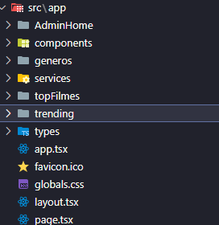

 **Services**:Esta pasta contém o arquivo api.ts onde são feitas a conexão com a API e suas requisições ,essas últimas feitas através dos endpoints.
 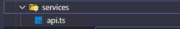

 **Types**:Pasta onde contém as tipagens personalizadas da aplicação,ela possui declarações de tipos e interfaces.
 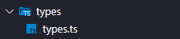

 **Components**:Nessa pasta estao os componentes que são compartilhados por outras partes da aplicação.Temos o ThemeContext que é onde estão as copnfigurações 
 para o uso do modo escuro nas páginas,temos também o sidebar que é usado para a navegação das páginas e ativação do modo escuro e por último temos o Pagecontainer que é a estilização padrão das páginas.
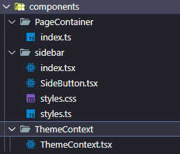

**generos**:A pasta contém a página de gêneros, cuja função é listar e mostrar os gêneros dos 250 filmes mais populares filtrados na aplicação, além de contabilizar a quantidade desses filmes presentes em cada gênero.
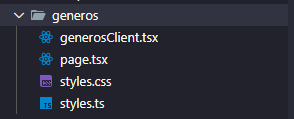

**topFilmes**:A pasta contém a página dos top 250 filmes com maiores notas ,cuja a função é listar e mostrar os 250 filmes com maiores notas e seus dados ,que vão de ano de lançamento a gêneros.
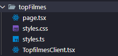

**trending**:É a pasta onde está contida a página que filtra quais dos filmes do topfilmes  estão nos trending ,além de lista-los ,motra-los e contabiliziar quantos são.
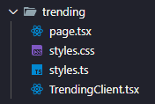

## GPT
Abaixo deixarei em anexo as imagens com os prompts e as funções fornecidas pelo chatGPT que forma utilizadas nessa aplicação(todas em ordem ).
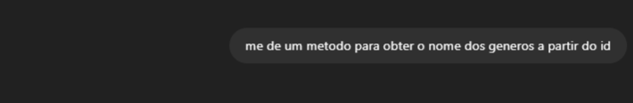
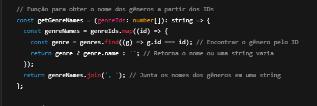

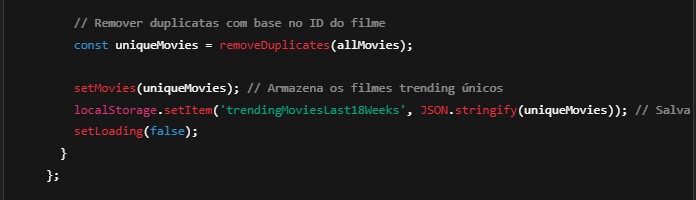
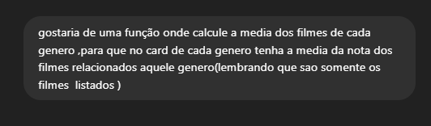
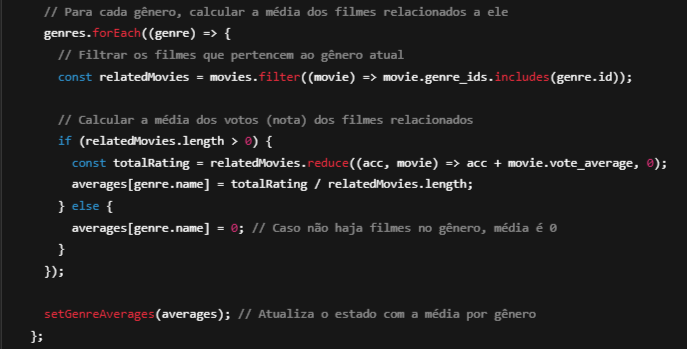
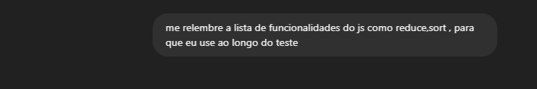
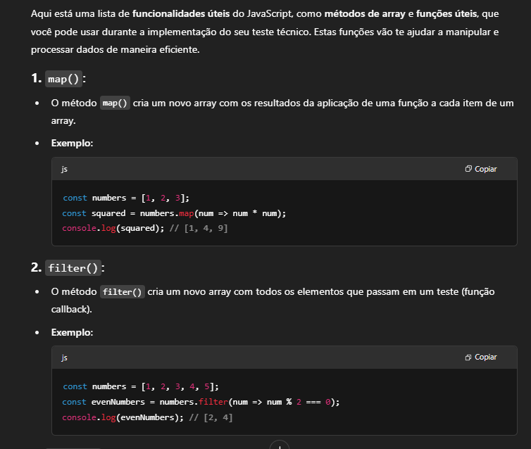
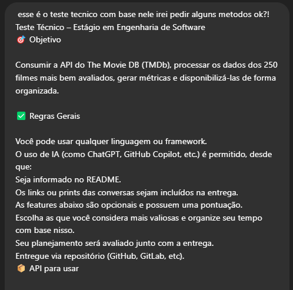

